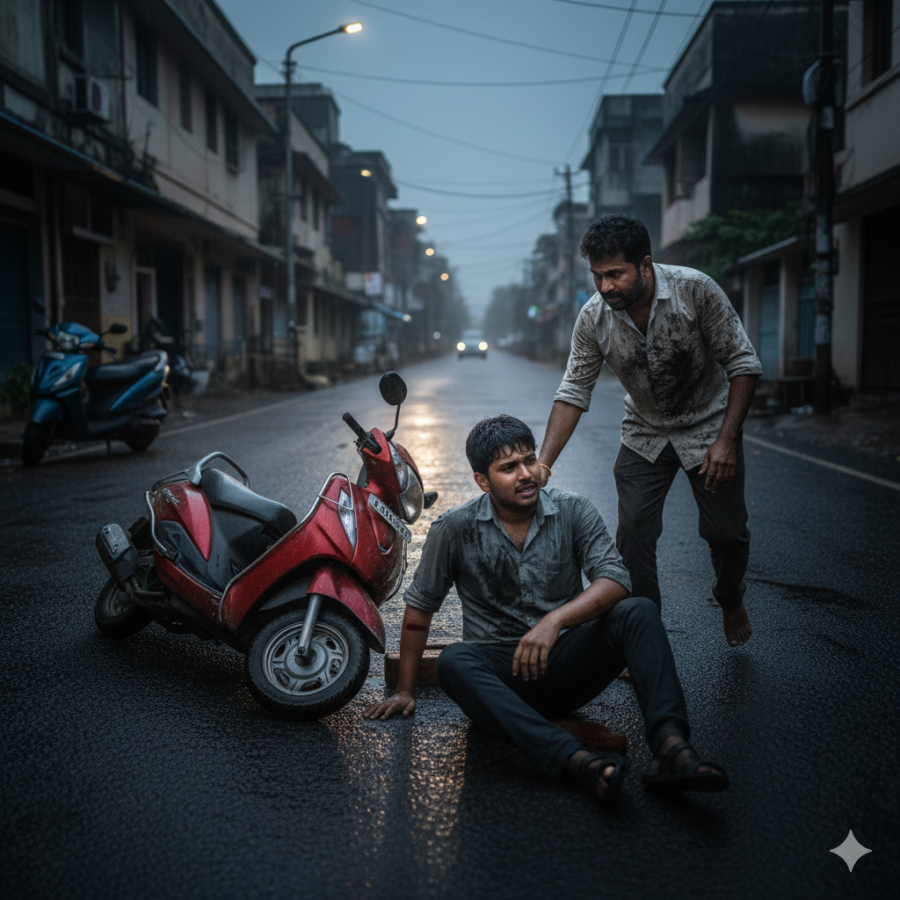

# மழைநீர் சேற்றில் மூன்று மனிதர்கள்

**கதை ஆசிரியர் : காங்கேயன் பசுபதி (கங்கா)**

சென்னை மாலை மழை. வானம் கருத்து, சாலை வழுக்கி, காற்றில் ஈரம். டி.நகர் பக்கம் ஒரு குறுகிய சாலை—அங்கே, நடுவில், ஒரு பள்ளம். வெறும் பள்ளமல்ல. கடந்த மூன்று மாதமாக, ஒவ்வொரு மழையிலும் பெரிதாகிக்கொண்டே இருந்த ஒரு குழி. இப்போது அது ஒரு சிறு குளம் போல காணப்பட்டது—கருப்பு நீரில், எண்ணெய் படலம் மிதந்தது.

## கண்ணன் — செங்கல் இடுபவன்

மாலை ஐந்து மணி. சைக்கிள் மெக்கானிக் கண்ணன், தன் பழைய TVS ஸ்கூட்டரை நிறுத்தி, அந்தப் பள்ளத்தைப் பார்த்தான். அவன் கண்களில் கோபமும் கவலையும் கலந்திருந்தன.

"போன வாரம் ஒரு பாட்டி இங்கே வழுக்கி விழுந்தாங்க. நான் பார்த்தேன். நகராட்சிக்கு ஆறு முறை போன் பண்ணியாச்சு. 'சீக்கிரம் பார்த்துக்கிறோம்'னு சொல்லிட்டு, யாரும் வரல," அவன் தனக்குள் முணுமுணுத்தான்.

சட்டென்று ஒரு முடிவு. அருகில் இருந்த கட்டுமானத் தளத்திற்குச் சென்று, இரண்டு, மூன்று செங்கல் கற்களை எடுத்தான். கவனமாக, அந்த கருப்பு நீரில், ஒரு தற்காலிக பாதையை அமைத்தான்.

"குழந்தைங்க காலையில போகும்போது, இதுல விழக்கூடாது," என்று தனக்குள் சொல்லிக்கொண்டான்.

அந்த நேரம், ஒரு வெள்ளை நிற காரின் ஹெட்லைட் வெளிச்சம் பளிச்சிட்டது.

<video width="640" height="360" controls>
  <source src="videos/கண்ணன்_—_செங்கல்_இடுபவன்.mp4" type="video/mp4">
  Your browser does not support the video tag.
</video>

## முரளி — சேறு தெறிப்பவன்

"Damn this traffic!" முரளி ஸ்டீயரிங்கை இறுக்கிப் பிடித்தான். அவனுடைய புதிய Hyundai Creta, வெள்ளைப் பளபளப்பு. வெறும் இரண்டு மாதம் தான் வாங்கியிருந்தான். ஏழு மணிக்கு ஒரு முக்கியமான கிளையண்ட் மீட்டிங்.

அவன் கண்ணன் இட்ட செங்கல் பாதையைப் பார்த்தான். "நல்லா இருக்கு, ஷார்ட்கட்!" என்று நினைத்து, முழு வேகமாக காரை செலுத்தினான்.

**ஸ்ப்ளாஷ்!**

காரின் டயர் அந்த நீரைத் தெறிக்கவிட்டது. கருப்பு சேறு, பீறிட்டு, கண்ணன் மீது விழுந்தது—அவன் முகம், சட்டை, எல்லாம் சேற்றில் நனைந்தது.

"ஏய்!" கண்ணன் கத்தினான்.

முரளி, ரியர்வியூ மிர்ரரில் ஒரு நொடி பார்த்தான். அவன் மனசாட்சி, "நிறுத்து, மன்னிப்புக் கேள்," என்று சொன்னது.

ஆனால் அவன் கையில் இருந்த விலை உயர்ந்த கடிகாரம், "7:00 PM meeting. VP waiting," என்று நினைவூட்டியது.

"Sorry, bro. But time is money," என்று தனக்குள் மன்னிப்புக் கேட்டுக்கொண்டு, ஆக்செலரேட்டரை அழுத்தினான். கார் மறைந்தது.

கண்ணன், தன் சேறு படிந்த சட்டையைப் பார்த்து, நீண்ட மூச்சு விட்டான். "ரெண்டு ரூபா செங்கல் வச்சு நல்லது பண்ணினா, ரெண்டு லட்ச கார்ல வந்து சேறு அடிச்சிட்டு போறாங்க. இதுதான் உலகம்," என்று கசப்புடன் நினைத்தான்.

அப்போது, மற்றொரு வாகனத்தின் சத்தம்.

<video width="640" height="360" controls>
  <source src="videos/சேறு_தெறித்த_கதை_தொடர்கிறது.mp4" type="video/mp4">
  Your browser does not support the video tag.
</video>

## அருண் — விதை பெறுபவன்

கல்லூரி மாணவன் அருண், தன் பழைய ஹோண்டா ஆக்டிவாவில் வேகமாக வந்தான். இயர்போன்களில் பாடல், கண்களில் கனவு, மனதில் அன்று பார்த்த பெண்ணின் சிரிப்பு.

அவன் செங்கல் பாதையைக் கவனிக்கவில்லை. சேற்றின் வழுக்கலை எதிர்பார்க்கவில்லை.

**ஸ்லிப்! க்ராஷ்!**

ஸ்கூட்டர் சாய்ந்து, அருண் தரையில் விழுந்தான். அவன் இடது கையில் இருந்து ரத்தம் வழிந்தது.

"ஐயோ! தம்பி!"

கண்ணன், தன் சேறு படிந்த உடலையும் மறந்து, விரைந்து ஓடி வந்தான். அருணையும் அவன் ஸ்கூட்டரையும் தூக்கி நிறுத்தினான்.

"நல்லாருக்கியா, தம்பி?" கண்ணனின் குரலில் உண்மையான கவலை.

அருண், தன் கையில் ஏற்பட்ட கீறலைப் பார்த்தான். வலி இருந்தது. ஆனால் அதை விட ஆச்சரியம் அதிகமாக இருந்தது.

இந்த மனிதர், தன்மீது சேறு அடித்துவிட்டுப் போன காரின் உரிமையாளரை நோக்கி கோபப்படாமல், தன்னை காப்பாற்ற வந்திருந்தார். அவரது சட்டை முழுவதும் சேறு. ஆனால் அவரது கண்களில், கருணை மட்டுமே.

"அண்ணே, நீங்க ஏன் இந்த செங்கல் எல்லாம் போட்டீங்க?" அருண் கேட்டான்.

கண்ணன் அந்த பள்ளத்தைப் பார்த்தான். பிறகு, அருணைப் பார்த்து, சிறு புன்னகையுடன் சொன்னான்:

> "என் அப்பா, நான் சின்ன பையனா இருக்கும்போது சொல்லியிருக்காரு. 'கண்ணா, குழி இருக்கிற இடத்தில் நீ மட்டும் தாண்டி வந்துட்டா போதாது. உன்னோட பின்னால வர்றவனும் தாண்டி வரணும். இல்லேன்னா, நீ தாண்டினதுல என்ன அர்த்தம் இருக்கு?' அப்பா இப்ப இல்லை. ஆனா அவரோட வார்த்தைங்க என் மனசுல இன்னும் இருக்கு."

அந்த வார்த்தைகள், அருணின் மனதில் மின்சாரம் போல் பாய்ந்தன.

## முப்பது நாட்களுக்குப் பிறகு

அருண், தன் கல்லூரியின் 'சமூகப் பணி' பிரிவின் தலைவரான பேராசிரியர் ரமேஷைச் சந்தித்தான்.

"Sir, எனக்கு ஒரு project idea இருக்கு."

"சொல்லு, அருண்."

"T.Nagar area-ல ஒரு சாலை. அங்க ரொம்ப மோசமான நிலை. நகராட்சி கவனிக்கல. நாம social media campaign, petition, media pressure—எல்லாத்தையும் use பண்ணி, அந்த சாலையை சரி பண்ண வைக்கலாம்."

பேராசிரியர் ரமேஷ், அருணின் கண்களில் ஒரு புதிய தீயைக் கண்டார். "Good. Team form பண்ணு. உனக்கு என் முழு support உண்டு."

அடுத்த இரண்டு வாரங்களில், அருணும் அவன் நண்பர்களும் ஒரு முழு campaign ஆரம்பித்தார்கள்:

- **#FixOurRoads** என்ற hashtag
- நகராட்சிக்கு முறைப்படி மனு
- உள்ளூர் பத்திரிகையாளர்களுக்கு விவரங்கள்
- சோஷியல் மீடியாவில் viral video

ஒரு மாதத்திற்குள், அந்தச் சாலை சரி செய்யப்பட்டது.

ஆனால், உணமையான மாற்றம் வேற இடத்துல நடந்தது.

<video width="640" height="360" controls>
  <source src="videos/the_same_story_rd_video_.mp4" type="video/mp4">
  Your browser does not support the video tag.
</video>

## ஐந்து ஆண்டுகளுக்குப் பிறகு

அருண், இப்போது ஒரு பெரிய IT நிறுவனத்தில் சீனியர் சாஃப்ட்வேர் என்ஜினியர். நல்ல சம்பளம், வசதியான வாழ்க்கை.

ஆனால் ஒவ்வொரு சனிக்கிழமையும், அவன் வேறு ஒரு வேலையில் ஈடுபடுகிறான். அவன் ஆரம்பித்த NGO, **"செங்கல் அறக்கட்டளை"**—சிறிய சிறிய சமூகப் பிரச்சினைகளை, இளைஞர்களின் சக்தியால் தீர்க்கும் அமைப்பு.

இன்று, அவன் ஒரு புதிய குழுவுடன் கூட்டம்.

அப்போது, அவன் மொபைலில் ஒரு கால். அந்தப் பக்கம், கண்ணன்.

"அருண், நீதான்யா?" கண்ணனின் குரல் நெகிழ்ச்சியுடன்.

"ஆமா, அண்ணே! நீங்க எப்படி என் நம்பர் கண்டுபிடிச்சீங்க?"

"பேப்பர்ல உன் போட்டோ பார்த்தேன். 'செங்கல் அறக்கட்டளை'னு. அந்த பேரை பார்த்ததும் நினைவு வந்துச்சு. நான் அன்னிக்கு போட்ட செங்கல் இன்னும் ஞாபகம் இருக்கா உனக்கு?"

அருணின் கண்களில் கண்ணீர்.

"அண்ணே, அந்த செங்கல்தான்... என் வாழ்க்கையையே மாத்திச்சு."

## கதையின் முடிவல்ல... ஆரம்பம்

அன்று மாலை, சென்னையில் மீண்டும் மழை.  
ஒரு சாலையில், ஒரு பள்ளம்.  
மூன்று வகையான மனிதர்கள்:

1. **முதலாமவன்**, தன் செங்கல்லை இடுகிறான்—சிறிய உதவி, பெரிய மனம்.
2. **இரண்டாமவன்**, தன் காரை ஓட்டிச் செல்கிறான்—சுயநலம், ஆனால் மனசாட்சியின் அமைதியின்மை.
3. **மூன்றாமவன்**, விழுகிறான், எழுகிறான், கற்றுக்கொள்கிறான், மாற்றம் செய்கிறான்.

**நீங்கள் எந்த மனிதர்?**

வாழ்க்கை உங்களுக்கு ஒரு செங்கல்லைக் காட்டும்போது, நீங்கள் அதைக் கடந்து செல்லலாம், அல்லது, அதை வைத்து ஒரு பாலம் கட்டலாம்.

தேர்வு உங்களுடையது.

ஆனால் நினைவில் கொள்ளுங்கள்: **ஒவ்வொரு பெரிய மாற்றமும், ஒரு சிறிய செங்கல்லில் இருந்துதான் ஆரம்பமாகிறது.**

---

*🧱 செங்கல் அறக்கட்டளை - சிறிய செயல்கள், பெரிய மாற்றங்கள் 🧱*

கதை ஆசிரியர் : காங்கேயன் பசுபதி (கங்கா)
